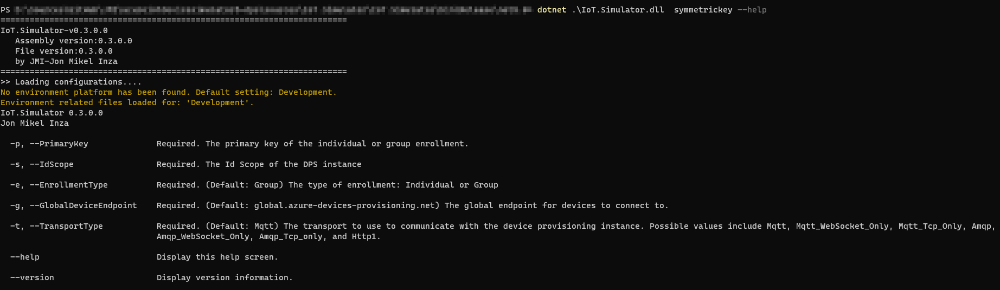
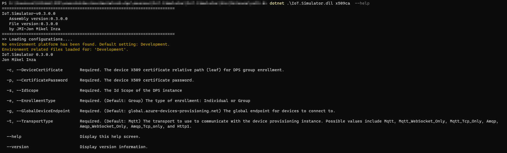

# Azure IoT Device Simulator (.NET 5, C#) - DPS version - Provisoning

## Provisioning
The implemented provisioning relies on [Azure IoT Hub Device Provisioning Service](https://docs.microsoft.com/en-us/azure/iot-dps/).

## Azure IoT Hub Device Provisioning Service

The simulator has the capability to contact a DPS with the provided configuration and get the connection settings for the assigned Azure IoT Hub.
The Azure IoT Hub is assigned according to the rules set in the DPS.

## Simulator DPS settings

The simulator has been designed to work with different provisioning use cases:
 1. If the simulator has no connection string, a provisioning process is initiated.
   This process requires a DPS configuration to be set.


   The DPS configuration can be provided by:
     - environment variables (might be useful in containerized platforms. Pay attention though to the processes allowed to read the environment variables.).
     - command line parameters, that will overwrite any existing environment variables setting (recommended for not containerized targets. This is probably the safest alternative among the three, in terms of security.).
     - if none of the previous settings are found, a `dpssettings.json` file will be loaded (recommended only for development platforms, unless the JSON is encrypted or stored in safe location.).
 2. If the simulator finds a connection string, the provisioning process is skipped and the found connection string is used. This avoids not necessary provisionning requests. In case a device needs to be reprovisionned, you only need to delete all the IoT Hub connection settings and the simulator will understand it needs to run the provisionning process again. Just keep in mind that to make this possible, the DPS settings need to be set.

> NOTE
>
> Besides the DPS settings, the environment variables allow to configure the device Id. The environment value will overwrite the value in the configuration file `devicesettings.json`.

## Simulator connection settings (device)
If the provisioning process succeeds, it will create a device identity in the associated Azure IoT Hub.
The DPS will send back to the device the keys and the connection string.

Those connection settings may be stored at the device level to avoid having to reprovision the device.
In production environments, they should be stored in a secured way (HSM, TPM, etc).

The simulator saves the connection string in the `devicesettings.json` file.
It is persisted in clear for develoment purposes but keep in mind this data should be protected more securely in production environments.

```json
{
  "deviceId": "",
  "connectionString": "",
  "simulationSettings": {
    "enableLatencyTests": false,
    "latencyTestsFrecuency": 30,
    "enableDevice": true,
    "enableModules": false,
    "enableTelemetryMessages": false,
    "telemetryFrecuency": 10,
    "enableErrorMessages": false,
    "errorFrecuency": 20,
    "enableCommissioningMessages": false,
    "commissioningFrecuency": 30,
    "enableTwinReportedMessages": false,
    "twinReportedMessagesFrecuency": 60,
    "enableReadingTwinProperties": false,
    "enableC2DDirectMethods": true,
    "enableC2DMessages": true,
    "enableTwinPropertiesDesiredChangesNotifications": true
  }
}

```
## Simulator connection settings (module identities)
If module identities are created, they will have their own connection string.
The connection string (and keys) will be generated dynamically by the process (device simulator and IoT Hub REST API).

If you need to create module identities, do not forget to set the `moduleId` field in the `modulesettings.json` file.
The `deviceId` has to be set too (either by the environment variable or in the `devicesettings.json` file).


## DPS settings
### Different possibilities
The simulator accepts different ways to use the DPS settings:
 - envionment variables
 - command line parameters
 - configuration file

> NOTE
>
> The deviceId parameter is required by the provisioning process. It is located in the `devicesettings.json` file for all the configuration types.

### Priorities
The first settings to be checked are environment variables.
Command line settings overwrite any setting provided by the environment variables.
If no environment setting or command line parameters are provided, a configuration file is searched. 

### Authentication settings
The simulator covers two authentication types:
 - symmetric keys
 - CA X509 certificates
 
Each authentication type, requires different DPS settings.

#### Symmetric keys
##### Environment variables
The list of the environment variables to set are:
 - DPS_SECURITY_TYPE = SymmetricKey
 - DPS_IDSCOPE, the Id Scope of the DPS
 - PRIMARY_SYMMETRIC_KEY, the primary pey of the DPS

_Linux (bash)_
```bash
export DPS_IDSCOPE='SymmetricKey'
export DPS_IDSCOPE=[YOUR DPS ID SCOPE]
export PRIMARY_SYMMETRIC_KEY=[YOUR PRIMMARY KEY]
dotnet IoT.Simulator.dll
```

_Windows (cmd)_
```cmd
set DPS_IDSCOPE='SymmetricKey'
set DPS_IDSCOPE=[YOUR DPS ID SCOPE]
set PRIMARY_SYMMETRIC_KEY=[YOUR PRIMMARY KEY]
dotnet IoT.Simulator.dll
```

> NOTE
>
> If the primary key is stored at some point, it should be saved in a secured mannger (TPM/HSM, etc).

##### Command line
To visualize the required settings, you can type:
```bash
dotnet IoT.Simulator.dll symmetrickey --help
```



The required parameters are the same:
 - -s, the Id Scope of the DPS
 - -p, the primary key of the DPS

Other required parameters by with default values:
 - -e, enrollment type (default and only possible now, Group)
 - -g, global DPS endpoint (default value, global.azure-devices-provisioning.net)
 - -t, transport type (default valyue, MQTT. The only one globally tested for now)

_Linux (bash)_
```bash
dotnet IoT.Simulator.dll symmetrickey -s [YOUR ID SCOPE] -p [YOUR PRIMMARY KEY]
```

_Windows (cmd)_
```cmd
dotnet IoT.Simulator.dll symmetrickey -s [YOUR ID SCOPE] -p [YOUR PRIMMARY KEY]
```


##### CA X509
To visualize the required settings, you can type:
```bash
dotnet IoT.Simulator.dll x509ca --help
```



##### Configuration file
DPS settings can also be provided through a configuration file.
It looks like this:

```json
{
  "dpsSettings": {
    "enrollmentType": "Group",
    "groupEnrollmentSettings": {
      "securityType": "SymmetricKey", //SymmetricKey, X509CA
      "symmetricKeySettings": {
        "idScope": "0ne000E3E14",
        "primaryKey": "wi3VEjzWZpxhPlWT85O8sg/hZvqk2sNPHPDsP+M9v73BKs9NQHky+Tvg/IFNu1QEWqt5OPZuz1Ia/9IM6R+rbb==",
        "enrollmentType": "Group",
        "globalDeviceEndpoint": "global.azure-devices-provisioning.net",
        "transportType": "Mqtt"
      },
      "CAX509Settings": {
        "idScope": "",
        "deviceX509Path": "",
        "password": "",
        "enrollmentType": "Group",
        "globalDeviceEndpoint": "global.azure-devices-provisioning.net",
        "transportType": "Mqtt"
      }
    }
  }
}
```

Parameters like `enrollmentType`, `globalDeviceEndpoint` and `transportType` cannot be changed for now.
Upcoming versions should allow more possibilities.

#### CA X509
##### Environment variables
The list of the environment variables to set are:
 - DPS_SECURITY_TYPE = SymmetricKey
 - DPS_IDSCOPE, the Id Scope of the DPS
 - PRIMARY_SYMMETRIC_KEY, the primary pey of the DPS

_Linux (bash)_
```bash
export DPS_SECURITY_TYPE='X509CA'
export DPS_IDSCOPE=[YOUR DPS ID SCOPE]
export DEVICE_CERTIFICATE_PATH=[Leaf certificate path]
export DEVICE_CERTIFICATE_PASSWORD=[Certificate password]
dotnet IoT.Simulator.dll
```

_Windows (cmd)_
```cmd
set DPS_SECURITY_TYPE='X509CA'
set DPS_IDSCOPE=[YOUR DPS ID SCOPE]
set DEVICE_CERTIFICATE_PATH=[Leaf certificate path]
set DEVICE_CERTIFICATE_PASSWORD=[Certificate password]
dotnet IoT.Simulator.dll
```

> NOTE
>
> If the primary key is stored at some point, it should be saved in a secured mannger (TPM/HSM, etc).

##### Command line
To visualize the required settings, you can type:
```bash
dotnet IoT.Simulator.dll x509ca --help
```


The required parameters are the same:
 - -s, the Id Scope of the DPS
 - -c, the leaf certificate path
 - -p, certificate password

Other required parameters by with default values:
 - -e, enrollment type (default and only possible now, Group)
 - -g, global DPS endpoint (default value, global.azure-devices-provisioning.net)
 - -t, transport type (default valyue, MQTT. The only one globally tested for now)

_Linux (bash)_
```bash
dotnet IoT.Simulator.dll x509ca -s [YOUR ID SCOPE] -c [your leaf certificate path] -p [your certificate password]
```

_Windows (cmd)_
```cmd
dotnet IoT.Simulator.dll x509ca -s [YOUR ID SCOPE] -c [your leaf certificate path] -p [your certificate password]
```

##### Configuration file
DPS settings can also be provided through a configuration file.
It looks like this:

```json
{
  "dpsSettings": {
    "enrollmentType": "Group",
    "groupEnrollmentSettings": {
      "securityType": "X509CA", //SymmetricKey, X509CA
      "symmetricKeySettings": {
        "idScope": "",
        "primaryKey": "",
        "enrollmentType": "Group",
        "globalDeviceEndpoint": "global.azure-devices-provisioning.net",
        "transportType": "Mqtt"
      },
      "CAX509Settings": {
        "idScope": "0ne000E3E14",
        "deviceX509Path": "X509\\new-device.devx5092.cert.pfx",
        "password": "1234",
        "enrollmentType": "Group",
        "globalDeviceEndpoint": "global.azure-devices-provisioning.net",
        "transportType": "Mqtt"
      }
    }
  }
}

```

Parameters like `enrollmentType`, `globalDeviceEndpoint` and `transportType` cannot be changed for now.
Upcoming versions should allow more possibilities.

> NOTE
>
> It seems that, when using CA X509 authentication with DPS, the device is created with symmetric keys.
> Do not be surprised by this. For now, is the normal behavior. This said, it has been reported to Microsoft in order to know whether there will be a way in the future to configure this.


## Device modules (a.k.a. module identities) provisioning
At the time this post has been written, it did not seem to be a way to create device modules (a.k.a. module identities) during the provisioning process.

This can be implemented by code but it requires one of the steps below:
 - reference the Azure IoT Hub Service SDK (which requires in turn a SAS connection string to the IoT Hub with specific rights....not really matching the security standards we are looking for in the implemented scenario with DPS).
 - reference a REST API taking in charge the creation of the device modules. The provisioned device could call that REST API once the DPS would have finished its job and that the device was provisioned.
 
 A version of a [REST endpoint implementing](https://github.com/jonmikeli/azureiotdevicesimulator5-dps/blob/master/sources/IoT.Simulator/IoT.Simulator.API.DeviceManagement/IoT.Simulator.API.DeviceManagement.API/Controllers/IoT/V1/DevicesControllerV1.cs) this has been included in the repository [here](https://github.com/jonmikeli/azureiotdevicesimulator5-dps/blob/master/sources/IoT.Simulator/IoT.Simulator.API.DeviceManagement/IoT.Simulator.API.DeviceManagement.API/Controllers/IoT/V1/DevicesControllerV1.cs).


```csharp
...
        public async Task<Module> AddModuleToDevice([FromBody] ProvisionModuleRequest value)
...
```

The used REST API structure is based on a REST API Template for .NET:
   - [Visual Studio 2019 version](https://marketplace.visualstudio.com/items?itemName=JonMikelInza.IoTHubDotNet5RESTAPITemplate)
   - [CLI version](https://www.nuget.org/packages/JMI.DotNet5.IoTHub.REST.API.Template.CSharp/)


The authentication mode of module identities is totally decorrelated from devices'.
For now, this implementation covers symmetric keys only for module identities.

## Dynamic creation of device simulators

One of the straightforward use cases of this simulator would be to create a set of devices dynamically.
The easiest way to achieve this would be:
 - create a Docker image with the IoT Hub REST API
 - create a Docker image with the simulator
 - create a container based on the image of the IoT Hub REST API
 - create a script that iterates to create containers based on the image of the simulator (the device Id may be provided by an environment variable)

> NOTE
> 
> Be sure the simulator containers can reach the IoT Hub REST API if you need to create module identities dynamically.

Simple script samples to create all this are provided [here](https://github.com/jonmikeli/azureiotdevicesimulator5-dps/tree/master/containers).

Other more enterprise oriented architectures could be considered with ACI or AKS.